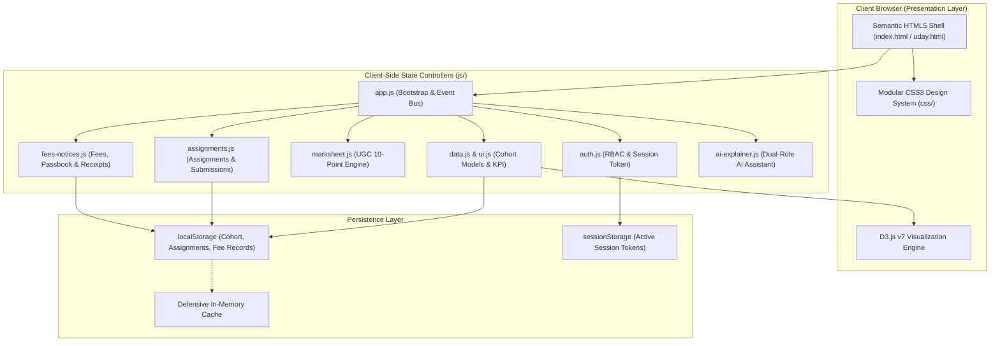
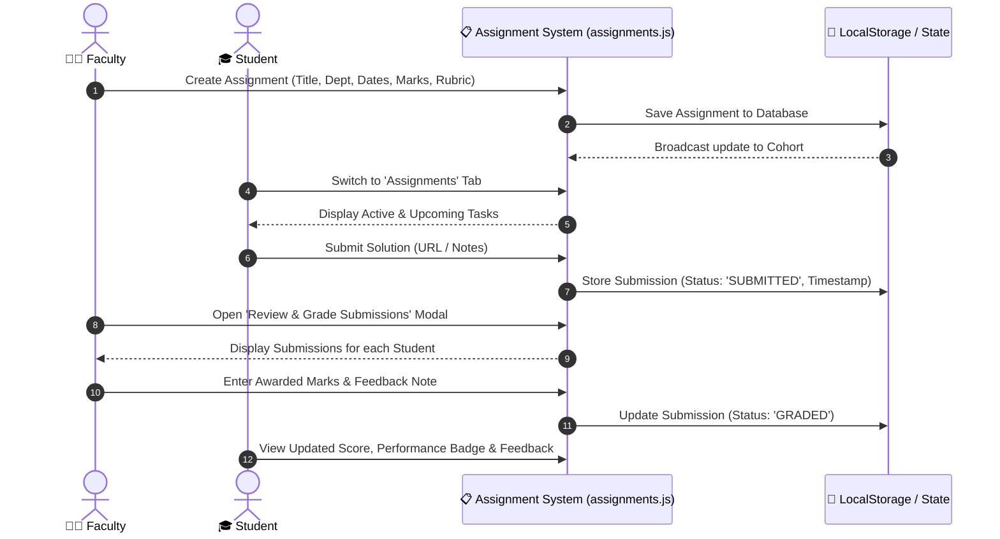
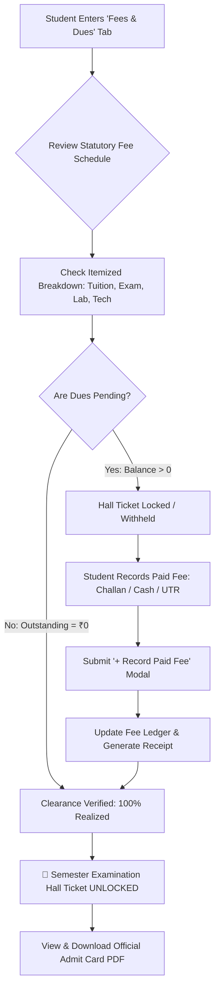
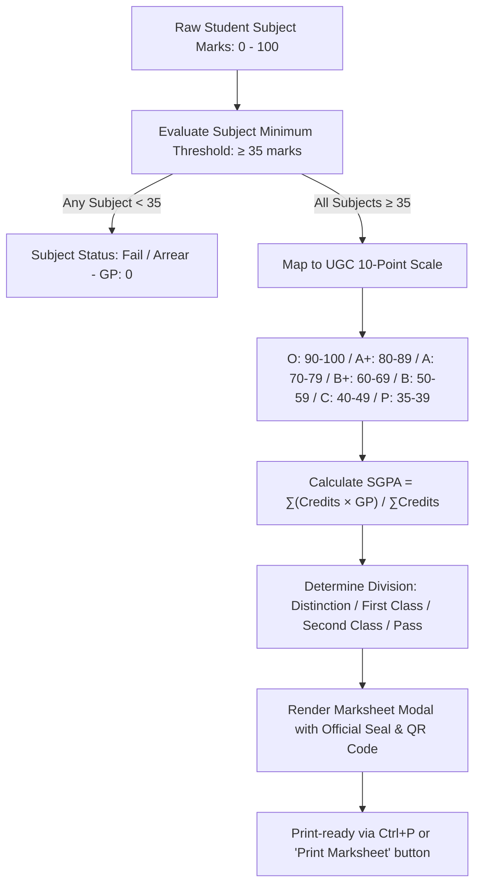

# ⚡ EduPulse — Intelligent Campus Analytics & Marksheet Portal
## Complete Project Overview & Technical Specification

> **Author:** Uday Kumar Reddy  
> **Repository:** [udaykumarreddy07/D3project](https://github.com/udaykumarreddy07/D3project)  
> **Standard:** UGC 10-Point Choice Based Credit System (CBCS)  
> **Core Stack:** Semantic HTML5, Modular CSS3, ES6+ JavaScript, D3.js v7, Node.js

---

## 📑 Table of Contents
1. [Executive Summary](#1-executive-summary)
2. [Problem Statement](#2-problem-statement)
   - [Formal Academic Formulation](#formal-academic-formulation)
   - [Presentation / PPT Highlights](#presentation--ppt-highlights)
   - [One-Sentence Elevator Pitch](#one-sentence-elevator-pitch)
3. [System Architecture & Architecture Diagrams](#3-system-architecture)
4. [Technology Stack & Design System](#4-technology-stack--design-system)
5. [In-Depth Subsystem & Module Breakdown](#5-in-depth-subsystem--module-breakdown)
   - [A. Dynamic D3.js Visual Analytics Engine](#a-dynamic-d3js-visual-analytics-engine)
   - [B. UGC 10-Point Marksheet & Evaluation Engine](#b-ugc-10-point-marksheet--evaluation-engine)
   - [C. Continuous Internal Assessment & Assignment Hub](#c-continuous-internal-assessment--assignment-hub)
   - [D. Statutory Fee Realization & Automated Hall Ticket Gating](#d-statutory-fee-realization--automated-hall-ticket-gating)
   - [E. Dual-Persona AI Academic Copilot](#e-dual-persona-ai-academic-copilot)
   - [F. Authentication Gateway & Session RBAC](#f-authentication-gateway--session-rbac)
6. [Role-Based Access Control (RBAC) Matrix](#6-role-based-access-control-rbac-matrix)
7. [System Workflows](#7-system-workflows)
   - [Assignment Creation & Grading Workflow](#assignment-creation--grading-workflow)
   - [Fee Realization & Admit Card Release Workflow](#fee-realization--admit-card-release-workflow)
   - [UGC Marksheet Generation Workflow](#ugc-marksheet-generation-workflow)
8. [Modular Directory Structure & File Map](#8-modular-directory-structure--file-map)
9. [Build System & Standalone Offline Bundle](#9-build-system--standalone-offline-bundle)
10. [Local Setup, CLI Commands & Demo Credentials](#10-local-setup-cli-commands--demo-credentials)

---

## 1. Executive Summary

**EduPulse** is an **Autonomous College Academic Operations & Analytics Portal** engineered to modernize higher education administrative workflows. Traditional campus management software relies on disjointed spreadsheets, static data tables, and manual departmental handoffs. 

EduPulse bridges this gap with a high-performance, zero-framework web architecture that integrates:
* **Interactive D3.js Visualizations:** Allowing faculty to identify academic bottlenecks, monitor department-wide CGPA averages, and uncover at-risk students before final examinations.
* **UGC 10-Point CBCS Marksheet Computation:** Automated GPA/CGPA calculations with pixel-perfect, print-ready university progress cards formatted for standard A4 printing.
* **Continuous Assessment Hub:** End-to-end assignment authoring, rubric-based submission, and real-time faculty feedback.
* **Automated Fee Realization & Exam Clearance:** Tamper-evident fee receipt generation and automatic hall ticket unlocking when financial balances reach zero.
* **Contextual AI Copilot:** A dual-persona artificial intelligence mentor tailored for student academic guidance and faculty cohort diagnostics.

---

## 2. Problem Statement

### Formal Academic Formulation
> *"In modern autonomous higher education institutions, academic workflows—such as continuous internal assessment, UGC Choice Based Credit System (CBCS) grade evaluations, institutional fee realization, and examination clearance—remain heavily fragmented across disparate, non-intuitive, or manual software silos.*
>
> *Conventional campus Enterprise Resource Planning (ERP) systems function primarily as static data stores; they lack interactive, visual analytics (such as multidimensional cohort distributions and radar skill proficiencies) necessary for faculty to identify at-risk students proactively. Furthermore, students suffer from a lack of real-time visibility into their academic trajectory, feedback loops on coursework, and transparent fee clearance tracking, often causing administrative bottlenecks during exam hall ticket issuance.*
>
> *Therefore, there is a critical need for a unified, lightweight, role-based analytics platform that couples real-time D3.js data visualizations and automated UGC 10-point grade computation with continuous assignment evaluation, automated fee-gated hall ticket workflows, and an intelligent dual-persona academic copilot."*

### Presentation / PPT Highlights
* **Fragmented Operations:** Academic grading, assignment management, and fee clearances operate in isolated tools, producing reconciliation errors and departmental delays.
* **Absence of Visual Intelligence:** Dense tabular spreadsheets obscure student trends, making it difficult for educators to spot struggling students early.
* **Delayed Feedback Cycles:** Students lack continuous insight into their academic performance and actionable paths to improve their cumulative GPA.
* **Manual Clearance Bottlenecks:** Examination hall ticket releases are slowed down by manual paper challans, counter receipts, and departmental queues.
* **No On-Demand Mentorship:** Institutions lack contextual AI assistants to resolve student academic queries or assist professors with grading rubrics.

### One-Sentence Elevator Pitch
> *"EduPulse addresses the fragmentation and lack of visual intelligence in modern campus ERPs by delivering a unified, zero-overhead portal that integrates D3.js academic analytics, automated UGC 10-point marksheet generation, fee-reconciled hall ticket unlocking, and dual-role AI academic mentoring."*

---

## 3. System Architecture

The application adopts a client-side **Model-View-Controller (MVC)** architecture. All business logic, grading arithmetic, and visualization rendering run natively inside the browser, backed by persistent local storage with graceful defensive fallbacks.



---

## 4. Technology Stack & Design System

| Layer | Technology | Rationale & Architectural Benefit |
|---|---|---|
| **Markup** | HTML5 Semantic Elements | High accessibility, search engine structure, clean modal dialog architectures. |
| **Styling** | Vanilla CSS3 (Custom Variables, Flexbox, CSS Grid) | Zero dependency overhead, modern glassmorphism, responsive across desktop and mobile. |
| **Print Styling** | `@media print` CSS | Transforms dynamic web progress cards into formal, ink-efficient A4 university marksheets. |
| **Visualizations** | **D3.js v7** | Direct manipulation of SVG documents with custom transitions, responsive scales, and interactive tooltips. |
| **Scripting** | Modern ES6+ JavaScript | Native modules, arrow functions, template literals, asynchronous dispatching, and safe `localStorage` caching. |
| **Runtime & Tooling** | Node.js (Built-in modules) | Zero-external-dependency local development server (`server.js`) and asset compilation (`build.js`). |

---

## 5. In-Depth Subsystem & Module Breakdown

### A. Dynamic D3.js Visual Analytics Engine
* **Location:** [`js/charts.js`](js/charts.js) | [`css/charts.css`](css/charts.css)
* **Cohort Grade Distribution:** D3 bar chart using `d3.scaleBand` and `d3.scaleLinear` to categorize students into UGC performance brackets (`O` through `F`).
* **Department Performance Donut:** Multi-colored radial chart using `d3.pie` and `d3.arc` visualizing cross-departmental averages.
* **Attendance vs. CGPA Scatter Plot:** Bivariate correlation chart mapping student attendance against final grades, instantly revealing attendance-risk students.
* **Student Skill Radar:** 5-axis spider diagram charting individual proficiencies (Data Structures, Algorithms, Web Engineering, Database Systems, System Design).

### B. UGC 10-Point Marksheet & Evaluation Engine
* **Location:** [`js/marksheet.js`](js/marksheet.js) | [`css/marksheet.css`](css/marksheet.css)
* **Grading Formula:** Converts raw scores (0–100) to UGC Letter Grades:
  $$\text{O: } 90\text{–}100 \ (10) \quad \text{A+: } 80\text{–}89 \ (9) \quad \text{A: } 70\text{–}79 \ (8) \quad \text{B+: } 60\text{–}69 \ (7)$$
  $$\text{B: } 50\text{–}59 \ (6) \quad \text{C: } 40\text{–}49 \ (5) \quad \text{P: } 35\text{–}39 \ (4) \quad \text{F: } <35 \ (0)$$
* **Division Classification:** Evaluates First Class with Distinction, First Class, Second Class, or Arrear.
* **Security & Printability:** Embeds institution seal, unique serial identifier, dynamic QR code verification, and watermark.

### C. Continuous Internal Assessment & Assignment Hub
* **Location:** [`js/assignments.js`](js/assignments.js) | [`css/assignments.css`](css/assignments.css)
* **Faculty Workspace:** Create, publish, and schedule coursework with start dates, hard deadlines, maximum points, and grading criteria.
* **Student Submission Interface:** Submit solutions with repository URLs, demo links, and descriptive notes.
* **Grading Modal:** Dedicated review interface allowing professors to review submissions, input marks, and record qualitative feedback notes.

### D. Statutory Fee Realization & Automated Hall Ticket Gating
* **Location:** [`js/fees-notices.js`](js/fees-notices.js) | [`css/fees-notices.css`](css/fees-notices.css)
* **Itemized Ledger:** Tracks Tuition, Exam Fee, Laboratory Charges, and Campus Technology Services.
* **Self-Reporting Gateway:** Allows students to log offline payments (Bank Challan, Cash Counter, UPI/NEFT UTR reference numbers).
* **Automated Clearance Guard:** Semester examination hall tickets remain locked until outstanding dues equal ₹0. Once cleared, an official verifiable admit card is unlocked.

### E. Dual-Persona AI Academic Copilot
* **Location:** [`js/ai-explainer.js`](js/ai-explainer.js) | [`css/ai-explainer.css`](css/ai-explainer.css)
* **Faculty Mode:** Auto-generates assignment rubrics, pinpoints struggling students, and suggests targeted remedial actions.
* **Student Mode:** Explains academic syllabus topics, calculates marks needed in remaining exams to hit target CGPAs, and verifies exam eligibility.

### F. Authentication Gateway & Session RBAC
* **Location:** [`js/auth.js`](js/auth.js) | [`css/auth.css`](css/auth.css)
* **Design:** Centered glassmorphism modal with animated glowing aurora backdrop.
* **One-Click Quick Logins:** Instant demo credential pills for faculty (`admin`) and sample student personas (`sneha`, `arun`).

---

## 6. Role-Based Access Control (RBAC) Matrix

```
┌──────────────────────────────────────┬─────────────────┬─────────────────┐
│ Feature / Capability                 │ Faculty / Admin │ Student         │
├──────────────────────────────────────┼─────────────────┼─────────────────┤
│ Cohort KPI Metrics & Overview        │ ✅ Yes          │ ❌ Restricted   │
│ Full Student CRUD (Add/Edit/Delete)  │ ✅ Yes          │ ❌ Restricted   │
│ Live Score Simulator                 │ ✅ Yes          │ ❌ Restricted   │
│ Batch Marksheet Generator            │ ✅ Yes          │ ❌ Restricted   │
│ Create Assignments & Set Due Dates   │ ✅ Yes          │ ❌ Restricted   │
│ Review Submissions & Award Grades    │ ✅ Yes          │ ❌ Restricted   │
│ Submit Coursework Solutions          │ ❌ Restricted   │ ✅ Yes          │
│ Personalized SGPA & Radar Chart      │ ❌ Restricted   │ ✅ Yes          │
│ Record Paid Fee / Self-Report Dues   │ ❌ Restricted   │ ✅ Yes          │
│ Official Marksheet & Admit Card      │ 👁️ View Batch   │ 📄 Personal     │
│ AI Academic Copilot Persona          │ 📊 Analytics    │ 🎓 Doubt Mentor │
└──────────────────────────────────────┴─────────────────┴─────────────────┘
```

---

## 7. System Workflows

### Assignment Creation & Grading Workflow


### Fee Realization & Admit Card Release Workflow


### UGC Marksheet Generation Workflow


---

## 8. Modular Directory Structure & File Map

```
D3project/
├── index.html                                   # Modular HTML shell & development entry point
├── uday.html                                    # Consolidated standalone offline distribution
├── presentation.html                            # Interactive slide deck with live embedded D3 charts
├── Academic_Analytics_Portal_Presentation.pptx  # 10-Slide Microsoft PowerPoint presentation
├── build.js                                     # Build tool (merges modular CSS & JS into uday.html)
├── server.js                                    # Lightweight Node.js local development server
├── report.js                                    # CLI terminal reporting tool
├── PROJECT_OVERVIEW.md                          # Comprehensive project documentation (this file)
├── README.md                                    # GitHub repository guide
├── package.json                                 # Project dependencies and script runner
│
├── css/                                         # 🎨 Modular Stylesheets
│   ├── styles.css                               # Global variables, typography, reset & button tokens
│   ├── auth.css                                 # Aurora glassmorphism login gateway & backdrop
│   ├── dashboard.css                            # Layout grid, KPI cards, table filters & inspection dock
│   ├── charts.css                               # D3 SVG chart containers, tooltips & legend styles
│   ├── marksheet.css                            # UGC Progress Card & @media print styles
│   ├── assignments.css                          # Coursework cards, submission forms & grading modal
│   ├── fees-notices.css                         # Fee schedule, digital passbook & admit cards
│   └── ai-explainer.css                         # Floating AI chat window & prompt chips
│
├── js/                                          # ⚡ Application Logic & Controllers
│   ├── data.js                                  # 22-student cohort dataset & academic structures
│   ├── database.js                              # LocalStorage state management adapter
│   ├── auth.js                                  # Session tokens, RBAC & login gateway triggers
│   ├── ui.js                                    # Dynamic KPI calculators, table sorting & toast notices
│   ├── charts.js                                # D3.js visualizers (Bar, Donut, Scatter, Radar)
│   ├── marksheet.js                             # UGC 10-point GPA calculation & card generator
│   ├── assignments.js                           # Assignment creation, submission & grading engine
│   ├── fees-notices.js                          # Fee realization, offline recording & hall tickets
│   ├── ai-explainer.js                          # Dual-persona AI copilot & query engine
│   └── app.js                                   # Main application bootstrap & event dispatch
│
└── data/
    └── students.json                            # Seed cohort dataset
```

---

## 9. Build System & Standalone Offline Bundle

The project incorporates an automated build utility:
* **Source:** [`build.js`](build.js)
* **Command:** `npm run build`
* **Mechanism:** Reads [`index.html`](index.html), parses external `<link rel="stylesheet">` tags in [`css/`](css/), parses external `<script src="...">` tags in [`js/`](js/), and inlines all code into a single, high-performance file: **[`uday.html`](uday.html)**.
* **Benefit:** Allows users to run the complete portal offline directly by double-clicking the file in any browser without needing Node.js or internet connectivity.

---

## 10. Local Setup, CLI Commands & Demo Credentials

### 1. Start the Local Server
```bash
npm run dev
# Starts server at http://localhost:3000
```

### 2. Run Instant Terminal Academic Audit
```bash
npm run report
# Additional CLI Filters:
node report.js --dept CSE      # Filter by Computer Science
node report.js --arrears       # List students with backlogs
node report.js --toppers       # Display top 5 CGPA performers
```

### 3. Rebuild the Standalone File
```bash
npm run build
```

### 4. Demo Login Credentials
| User Persona | Username | Password | Role & Default Student Context |
|---|---|---|---|
| **Faculty / Admin** | `admin` | `admin123` | Full administrative, grading, and analytics access |
| **Student (Topper)** | `sneha` | `pass123` | **Sneha Devi** (Roll: 22A91A0504, Dept: CSE, SGPA: 9.80) |
| **Student** | `arun` | `pass123` | **Arun Kumar** (Roll: 22A91A0501, Dept: CSE, SGPA: 9.20) |

---

*Document compiled for review panels, academic vivas, project documentation, and institutional presentation archives.*
