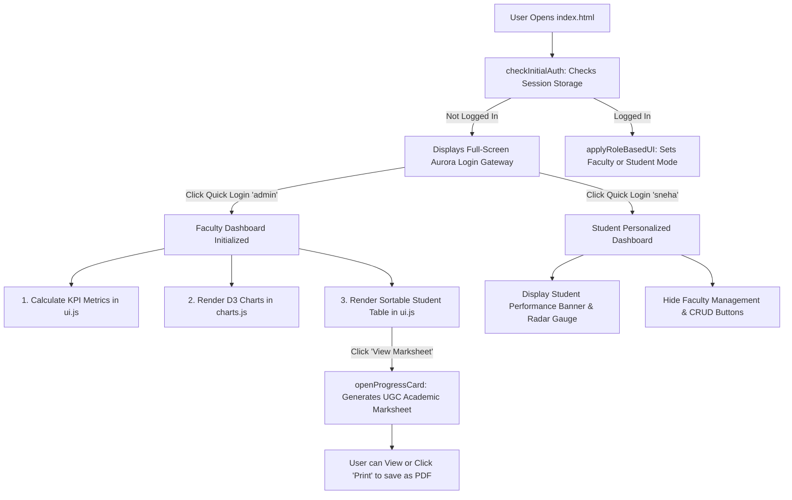

# 🎓 Academic Analytics & Student Marksheet Portal
> **A complete, modular web application and learning guide for Data Visualization with D3.js, UGC Academic Grading, and Role-Based Access Control.**

---

## 📖 1. What is this Project? (Plain English Summary)

This project is an **Autonomous College Academic Performance & Marksheet Portal**. It solves a common university problem: how to analyze student cohort performance across multiple engineering departments (CSE, ECE, EEE, MECH, CIVIL), visualize pass/fail distributions with interactive charts, and instantly generate official, printable semester marksheet cards compliant with the **UGC 10-point grading scale**.

### 🌟 Key Highlights:
1. **Zero-Framework Vanilla Stack**: Built with pure JavaScript (ES6+), CSS3, Semantic HTML5, and **D3.js v7** for lightning-fast performance and clean learning without complex framework bloat.
2. **Clean Modular Architecture**: Organized into dedicated language subfolders (`css/`, `js/`, `data/`) for maximum readability and separation of concerns.
3. **Dual-Role RBAC (Role-Based Access Control)**:
   - 👨‍🏫 **Faculty / Admin**: Full CRUD (Add, Edit, Delete students), live real-time simulation, batch marksheet viewer, CSV export, and cohort analytics.
   - 🎓 **Student**: Personalized performance banner, subject radar proficiency chart, attendance gauge, and instant official marksheet access.
4. **Interactive D3.js Visualizations**: Bar charts, Pass/Fail donut charts, Scatter correlation plots, and Student Radar/Gauge diagrams.
5. **Print-Ready Academic Marksheets**: Dedicated `@media print` styling for high-contrast, official A4 progress cards.

---

## 📁 2. Project Architecture & Directory Structure

```
D3project/
├── index.html                                   # Clean HTML entry point (Structure & Shell)
├── presentation.html                            # Interactive web presentation (Live D3 bar graph)
├── Academic_Analytics_Portal_Presentation.pptx  # 10-Slide Microsoft PowerPoint presentation deck
├── README.md                                    # Comprehensive learning and architecture guide
├── BEGINNER_GUIDE.md                            # 📘 Deep Beginner's Learning Manual & D3.js Guide
├── presentation/                                # 📽️ [Presentation Subfolder Layer]
│   ├── index.html                               # Interactive web presentation (Live D3 bar graph)
│   ├── Academic_Analytics_Portal_Presentation.pptx # 10-Slide Microsoft PowerPoint presentation deck
│   ├── PRESENTATION_ARCHITECTURE_GUIDE.md       # Complete 10-slide architecture & speaker guide
│   └── generate_ppt.js                          # PPTX generation script
│
├── css/                                         # 🎨 [Stylesheets Layer]
│   ├── styles.css                               # Global design tokens, resets, body & UI utilities
│   ├── auth.css                                 # Login Gateway, Aurora light backgrounds & glassmorphism
│   ├── dashboard.css                            # Navigation, KPI cards, filter controls & data tables
│   ├── charts.css                               # D3.js SVG chart containers, axes & legends
│   └── marksheet.css                            # UGC Academic Progress Card & print stylesheet
│
├── js/                                          # ⚡ [Application Logic Layer]
│   ├── data.js                                  # 22-Student cohort dataset, department maps & storage layer
│   ├── auth.js                                  # Authentication system, demo logins & role switcher
│   ├── marksheet.js                             # UGC 10-point GPA calculator & marksheet modal
│   ├── ui.js                                    # Dynamic KPI stats, data table, sorting & toasts
│   ├── charts.js                                # D3.js visualizers (Dept Bar, Donut, Scatter, Gauge)
│   └── app.js                                   # Main application bootstrap, CRUD & event handlers
│
└── data/                                        # 📊 [Data Layer]
    └── students.json                            # Standalone JSON export of the student cohort
```

---

## 🧠 3. How Each Module Works (Deep Dive)

### 🎨 A. The Stylesheet Subfolder (`css/`)
| File | Responsibility |
|---|---|
| **[styles.css](file:///c:/Users/udayk/OneDrive/Desktop/D3project/css/styles.css)** | Defines CSS custom properties (`:root` colors: `#4f46e5` Indigo, `#0ea5e9` Sky, `#8b5cf6` Violet), universal box resets, typography, common button styles (`.btn`, `.btn-primary`), tooltips, and floating toast notifications. |
| **[auth.css](file:///c:/Users/udayk/OneDrive/Desktop/D3project/css/auth.css)** | Styles the full-screen glowing **Aurora** login gateway overlay, animated light sweeps, floating particles, glassmorphic login card, and quick-login demo chips. |
| **[dashboard.css](file:///c:/Users/udayk/OneDrive/Desktop/D3project/css/dashboard.css)** | Styles the top portal header, faculty/student role switch badges, 4 KPI metric cards, filter search bar, and the interactive sortable table grid. |
| **[charts.css](file:///c:/Users/udayk/OneDrive/Desktop/D3project/css/charts.css)** | Formats D3.js SVG containers, grid lines, axis tick labels, hover glow effects, and responsive chart card wrappers. |
| **[marksheet.css](file:///c:/Users/udayk/OneDrive/Desktop/D3project/css/marksheet.css)** | Renders the official autonomous progress card modal (college seal, subject scorecard, semester GPA summary, controller signatures) and provides `@media print` rules for clean A4 printing. |

---

### ⚡ B. The JavaScript Subfolder (`js/`)
| File | Responsibility |
|---|---|
| **[data.js](file:///c:/Users/udayk/OneDrive/Desktop/D3project/js/data.js)** | Holds the default 22-student cohort dataset, pre-seeded demo user credentials (`admin`, `sneha`, `arun`), department maps, and a multi-tiered storage helper (`safeSetItem` / `safeGetItem`) that cascades from `localStorage` &rarr; `sessionStorage` &rarr; memory fallback. |
| **[auth.js](file:///c:/Users/udayk/OneDrive/Desktop/D3project/js/auth.js)** | Handles user authentication, demo fast-logins (`quickLogin('admin')`), role switching (`quickSwitchRole('Student')`), session tokens, and dynamic Role-Based UI switching (`applyRoleBasedUI()`). |
| **[marksheet.js](file:///c:/Users/udayk/OneDrive/Desktop/D3project/js/marksheet.js)** | Contains academic evaluation algorithms: calculates individual subject grades, overall percentage, division remarks, and renders the official progress card modal (`openProgressCard()`). |
| **[ui.js](file:///c:/Users/udayk/OneDrive/Desktop/D3project/js/ui.js)** | Manages dynamic KPI stats calculation (Total Students, Class Avg %, Pass Rate %, Top Performer), multi-column table sorting (`sortTable()`), multi-criteria filtering, toast alerts (`showToast()`), and CSV export. |
| **[charts.js](file:///c:/Users/udayk/OneDrive/Desktop/D3project/js/charts.js)** | Houses all D3.js SVG visualizations: Department Average Bar Chart, Pass/Fail Donut, Subject Correlation Scatter Plot, and Student Radar/Gauge Charts. |
| **[app.js](file:///c:/Users/udayk/OneDrive/Desktop/D3project/js/app.js)** | Central hub that bootstraps the app (`initializeData()`), binds modal CRUD events (Add/Edit/Delete student records), handles real-time live score push simulations, and orchestrates dashboard updates. |

---

## 📊 4. The Academic Evaluation Formula (UGC 10-Point Scale)

The portal strictly enforces the standard Indian **UGC 10-Point Letter Grading System**:

| Marks Range | Letter Grade | Grade Point (GP) | Description | Academic Result |
|---|:---:|:---:|---|:---:|
| **90 – 100** | **O** | **10** | Outstanding | Passed (First Class with Distinction) |
| **80 – 89** | **A+** | **9** | Excellent | Passed (First Class) |
| **70 – 79** | **A** | **8** | Very Good | Passed (First Class) |
| **60 – 69** | **B+** | **7** | Good | Passed (Second Class) |
| **50 – 59** | **B** | **6** | Above Average | Passed (Second Class) |
| **40 – 49** | **C** | **5** | Average | Passed (Pass Division) |
| **35 – 39** | **P** | **4** | Pass Threshold | Passed (Pass Division) |
| **0 – 34** | **F** | **0** | Fail / Re-appear | **FAILED (Backlog)** |

### 📐 Calculation Logic:
1. **Pass Requirement**: Student must score **&ge; 35 marks** in *all four subjects* (Maths, Science, English, Programming). If any subject is `< 35`, overall status is **Fail (F)**.
2. **SGPA (Semester Grade Point Average)**:
   $$\text{SGPA} = \frac{\sum (\text{Credits}_i \times \text{Grade Point}_i)}{\sum \text{Credits}_i}$$

---

## 🔄 5. Step-by-Step Execution Flow (How the App Runs)



---

## 🚀 6. Getting Started & Demo Logins

### How to Run:
No server setup, `npm install`, or build step required! Simply double-click **[index.html](file:///c:/Users/udayk/OneDrive/Desktop/D3project/index.html)** in any browser.

### 🔑 Instant Demo Accounts:
| Role | Username | Password | Purpose |
|---|---|---|---|
| **Faculty / Admin** | `admin` | `admin123` | Full admin controls, student CRUD, live simulator, batch marksheet generator, CSV export. |
| **Student (Sneha Devi)** | `sneha` | `pass123` | Ranked top student (94.5% Avg, Grade O), personalized scorecard, subject radar chart. |
| **Student (Arun Kumar)** | `arun` | `pass123` | First-class CSE student (89.75% Avg, Grade A+), personalized progress card. |

---

## 📽️ 7. Presentation Materials Included

To present and explain this project in meetings, seminars, or viva reviews:

1. 🌐 **[presentation.html](file:///c:/Users/udayk/OneDrive/Desktop/D3project/presentation.html)**:
   - Interactive slide deck that opens in any browser.
   - Includes a **live D3.js animated bar graph** on Slide 5 (toggle between Average Marks % and Pass Rate %).
   - Keyboard controls: `←` / `→` or `Space`, press `F` for Fullscreen, `Ctrl+P` to export slides to PDF.

2. 📥 **[Academic_Analytics_Portal_Presentation.pptx](file:///c:/Users/udayk/OneDrive/Desktop/D3project/Academic_Analytics_Portal_Presentation.pptx)**:
   - 10-slide 16:9 widescreen Microsoft PowerPoint deck with native embedded editable bar charts, architecture diagrams, and UGC grading tables.

---

## 💡 8. Key Programming Concepts to Learn From This Project

1. **D3.js Data Joins & Coordinate Scales**:
   - `d3.scaleBand()`: Used for categorical axes (Departments, Subjects).
   - `d3.scaleLinear()`: Used for numerical continuous axes (0 to 100 marks).
   - `d3.pie()` & `d3.arc()`: Used for the Pass vs Fail donut breakdown.
   - `.transition().duration(800)`: Creates smooth bar-rising animations.
2. **Defensive Storage Wrapper (`safeGetItem` / `safeSetItem`)**:
   - Handles browser environments where `localStorage` might be disabled or blocked by falling back smoothly to `sessionStorage` or in-memory state.
3. **High-Performance Client-Side Sorting**:
   - `students.sort((a, b) => ...)` with multi-column directional caching.
4. **Print Optimization**:
   - `@media print` rules hiding navigation overlays, removing modal backdrops, and ensuring crisp A4 dimensions with zero background color distortion.
