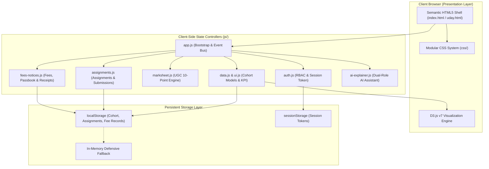
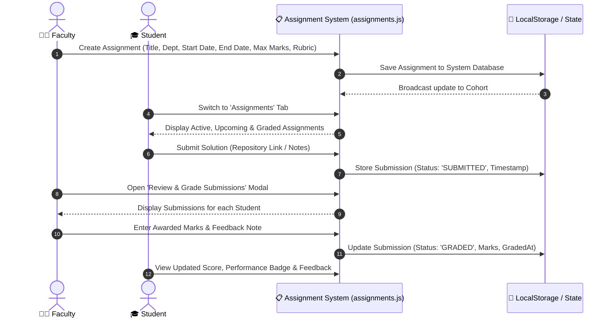
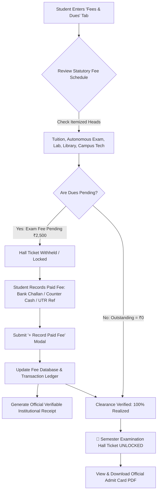
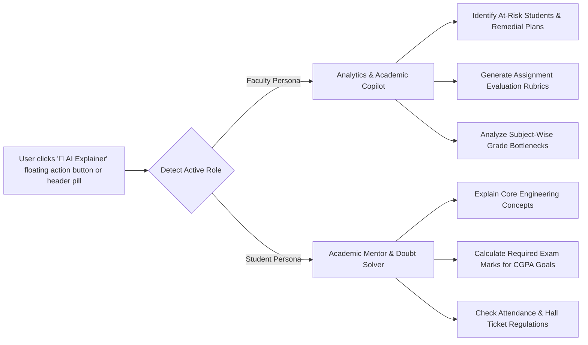
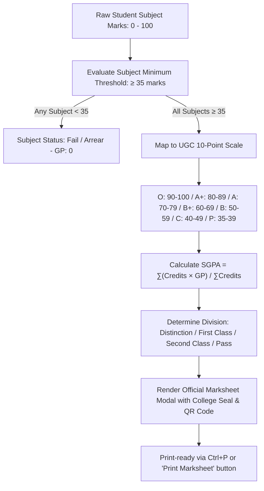

# ⚡ EduPulse — Intelligent Campus Analytics & Marksheet Portal
> **A high-performance, modular autonomous college portal featuring D3.js Visualizations, UGC 10-Point Grading, Faculty Assignment Grading, AI Academic Explainer, and Institutional Fee Tracking.**

[](https://github.com/udaykumarreddy07/D3project)
[]()
[]()
[]()

---

## 📑 Table of Contents
1. [Overview & Highlights](#-1-overview--highlights)
2. [High-Level Architecture](#-2-high-level-architecture)
3. [System Workflows](#-3-system-workflows)
   - [A. Assignment Management & Grading Workflow](#a-assignment-management--grading-workflow)
   - [B. Student Fee Realization & Hall Ticket Workflow](#b-student-fee-realization--hall-ticket-workflow)
   - [C. AI Explainer & Academic Copilot Workflow](#c-ai-explainer--academic-copilot-workflow)
   - [D. Marksheet Generation & UGC 10-Point Evaluation](#d-marksheet-generation--ugc-10-point-evaluation)
4. [Modular Directory Structure](#-4-modular-directory-structure)
5. [Module-by-Module Technical Deep Dive](#-5-module-by-module-technical-deep-dive)
6. [Role-Based Access Control (RBAC)](#-6-role-based-access-control-rbac)
7. [Getting Started & Local Setup](#-7-getting-started--local-setup)
8. [Demo Credentials](#-8-demo-credentials)
9. [Presentation & Export Assets](#-9-presentation--export-assets)

---

## 🌟 1. Overview & Highlights

This project is an **Autonomous College Academic Operations & Analytics Portal**. It unifies academic cohort tracking, continuous internal evaluation, financial clearances, and real-time guidance into a single web application:

1. **Zero-Framework Vanilla Core**:
   - Engineered in pure semantic HTML5, modern CSS3 (Custom Properties, Glassmorphism, Print CSS), and ES6+ JavaScript.
   - Powered by **D3.js v7** for data visualization without heavy framework overhead.
2. **Dual-Role RBAC (Faculty vs. Student)**:
   - 👨‍🏫 **Faculty Portal**: Live cohort KPI cards, full CRUD student record management, real-time score simulator, assignment creator with evaluation rubrics, student submission grading modal with live feedback, and cohort fee audit monitor.
   - 🎓 **Student Portal**: Personalized GPA/CGPA summary, D3 radar proficiency chart, assignment submission portal with marks/feedback view, itemized fee schedule, self-reporting payment ledger, official verifiable receipts, and autonomous exam hall ticket release.
3. **AI Explainer & Academic Copilot**:
   - Built-in contextual AI mentor for both faculty (cohort interventions, assignment rubrics, UGC regulation queries) and students (concept explanations, SGPA improvement plans, examination eligibility).
4. **Institutional Fee Management**:
   - Clear itemized fee schedules ("what fees they have to pay").
   - Offline & online transaction self-reporting ("record what fees they paid" with UTR, bank challan, or counter receipts).
   - Tamper-evident printable institutional receipts, passbook transaction logs, and annual fee statements.
5. **Print-Ready Academic Marksheets**:
   - Pixel-perfect `@media print` CSS for authentic university marksheet cards formatted for standard A4 printing.

---

## 🏗️ 2. High-Level Architecture

The system follows a clean **Model-View-Controller (MVC)** client-side architecture with persistent state synchronizing to `localStorage` and seamless fallback to memory:



---

## 🔄 3. System Workflows

### A. Assignment Management & Grading Workflow
Faculty can assign coursework with start and end dates visible to all students; students can submit their work directly from their dashboard; faculty can inspect and grade every submission with feedback:



---

### B. Student Fee Realization & Hall Ticket Workflow
Students review their fee schedule, record payments made via bank challan/counter/UPI, inspect verified receipts, and automatically unlock their autonomous semester examination hall ticket:



---

### C. AI Explainer & Academic Copilot Workflow
The dual-engine AI assistant serves both user personas with zero setup:



---

### D. Marksheet Generation & UGC 10-Point Evaluation



---

## 📁 4. Modular Directory Structure

```
D3project/
├── index.html                                   # Modular HTML shell & application entry point
├── uday.html                                    # Consolidated all-in-one distribution bundle
├── presentation.html                            # Interactive slide deck with live embedded D3 charts
├── Academic_Analytics_Portal_Presentation.pptx  # 10-Slide Microsoft PowerPoint presentation deck
├── build.js                                     # Asset synchronizer (merges modular CSS/JS into uday.html)
├── server.js                                    # Built-in lightweight Node.js development server
├── report.js                                    # CLI terminal reporting tool
├── package.json                                 # Project metadata and npm scripts
├── README.md                                    # Complete project documentation & guide
│
├── css/                                         # 🎨 Stylesheet Subsystem
│   ├── styles.css                               # Design tokens, resets, buttons, badges & tooltips
│   ├── auth.css                                 # Aurora glowing login gateway & glassmorphism
│   ├── dashboard.css                            # Layout grid, KPI cards, table filters & inspection dock
│   ├── charts.css                               # D3.js SVG chart wrappers, gridlines & legends
│   ├── marksheet.css                            # UGC Progress Card & @media print stylesheet
│   ├── assignments.css                          # Assignment creator, student submission cards & grading modal
│   ├── fees-notices.css                         # Fee schedules, passbook ledger, receipts & admit cards
│   └── ai-explainer.css                         # AI floating copilot window, chat stream & prompt chips
│
├── js/                                          # ⚡ Application Logic Subsystem
│   ├── data.js                                  # 22-student cohort dataset, course maps & safe storage
│   ├── auth.js                                  # Session management, role switching & gateway triggers
│   ├── ui.js                                    # Dynamic KPI calculators, table sorting & toast notices
│   ├── charts.js                                # D3.js visualizers (Bar, Donut, Scatter, Radar, Gauge)
│   ├── marksheet.js                             # UGC 10-point GPA calculation & marksheet generator
│   ├── assignments.js                           # Assignment authoring, submission handling & grading engine
│   ├── fees-notices.js                          # Fee schedule, offline self-reporting, passbook & receipts
│   ├── ai-explainer.js                          # Dual-engine AI Academic Copilot & chat interface
│   └── app.js                                   # Main application bootstrap & event dispatch
│
└── data/                                        # 📊 Static Data Assets
    └── students.json                            # Seed cohort dataset
```

---

## 🧠 5. Module-by-Module Technical Deep Dive

| Module | Location | Primary Responsibilities |
|---|---|---|
| **Assignment Hub** | [`js/assignments.js`](js/assignments.js)<br>[`css/assignments.css`](css/assignments.css) | Handles faculty assignment authoring (title, start date, due date, max marks, rubrics), student submission intake (files, git repos, solutions), and faculty grading modal with score award & feedback notes. |
| **Fees & Passbook** | [`js/fees-notices.js`](js/fees-notices.js)<br>[`css/fees-notices.css`](css/fees-notices.css) | Powers student fee schedules, self-reported offline payment recording (challan/cash/UTR), real-time passbook ledger, printable receipts, and exam hall ticket clearance. |
| **AI Academic Copilot** | [`js/ai-explainer.js`](js/ai-explainer.js)<br>[`css/ai-explainer.css`](css/ai-explainer.css) | Powers floating dual-role academic advisor with automated response engines for student doubts and faculty cohort diagnostics. |
| **D3 Visualizations** | [`js/charts.js`](js/charts.js)<br>[`css/charts.css`](css/charts.css) | Implements D3.js coordinate scales (`scaleBand`, `scaleLinear`), pie/donut generators (`d3.pie`, `d3.arc`), correlation scatter plots, and student radar charts. |
| **UGC Marksheets** | [`js/marksheet.js`](js/marksheet.js)<br>[`css/marksheet.css`](css/marksheet.css) | Computes UGC 10-point GP, SGPA, and renders tamper-proof progress cards with university seals, verification QR code, and print styles. |
| **Authentication** | [`js/auth.js`](js/auth.js)<br>[`css/auth.css`](css/auth.css) | Manages quick-login presets, session tokens, and dynamic role-based UI switching (`applyRoleBasedUI`). |

---

## 🔐 6. Role-Based Access Control (RBAC)

The portal implements strict client-side role differentiation:

```
┌─────────────────────────────────┬─────────────────┬─────────────────┐
│ Feature / Capability            │ Faculty / Admin │ Student         │
├─────────────────────────────────┼─────────────────┼─────────────────┤
│ Cohort KPI Metrics & Overview   │ ✅ Yes          │ ❌ Restricted   │
│ Full Student CRUD (Add/Edit/Del)│ ✅ Yes          │ ❌ Restricted   │
│ Live Score Simulator            │ ✅ Yes          │ ❌ Restricted   │
│ Batch Marksheet Generator       │ ✅ Yes          │ ❌ Restricted   │
│ Create Assignments & Set Dates  │ ✅ Yes          │ ❌ Restricted   │
│ Review & Grade Submissions      │ ✅ Yes          │ ❌ Restricted   │
│ Submit Coursework / Assignments │ ❌ Restricted   │ ✅ Yes          │
│ Personalized SGPA & Radar Chart │ ❌ Restricted   │ ✅ Yes          │
│ Record Paid Fee / Self-Report   │ ❌ Restricted   │ ✅ Yes          │
│ Official Marksheet & Admit Card │ 👁️ View Batch   │ 📄 Personal     │
│ AI Academic Copilot             │ 📊 Analytics    │ 🎓 Doubt Mentor │
└─────────────────────────────────┴─────────────────┴─────────────────┘
```

---

## 🚀 7. Getting Started & Local Setup

### Prerequisites
- Node.js (v14+ recommended) or any static HTTP web server.

### 1. Clone the Repository
```bash
git clone https://github.com/udaykumarreddy07/D3project.git
cd D3project
```

### 2. Start the Local Server
```bash
npm run dev
```
The server will start at **`http://localhost:3000`** (or next available port).

### 3. Build & Synchronize Distribution Bundle
If you modify modular files in `css/` or `js/`, synchronize the all-in-one `uday.html` bundle with:
```bash
npm run build
```

### 4. Run Instant CLI Terminal Report
Generate an instantaneous terminal audit without starting a browser:
```bash
npm run report
```
*Filter by department*: `node report.js --dept CSE`  
*Show only backlogs/arrears*: `node report.js --arrears`  
*Show toppers*: `node report.js --toppers`

---

## 🔑 8. Demo Credentials

The portal includes one-click instant demo login chips on the login screen:

| Role | Username | Password | Default Student Profile |
|---|---|---|---|
| **Faculty / Admin** | `admin` | `admin123` | Full Autonomous Academic Control |
| **Student (Topper)** | `sneha` | `pass123` | **Sneha Devi** (Roll: 22A91A0504, Dept: CSE, Grade: O, SGPA: 9.80) |
| **Student** | `arun` | `pass123` | **Arun Kumar** (Roll: 22A91A0501, Dept: CSE, Grade: A+, SGPA: 9.20) |

---

## 📽️ 9. Presentation & Export Assets

- 🌐 **[`presentation.html`](presentation.html)**: Interactive browser slide presentation containing an embedded interactive D3 bar graph with live data toggling.
- 📊 **[`Academic_Analytics_Portal_Presentation.pptx`](Academic_Analytics_Portal_Presentation.pptx)**: 10-slide 16:9 widescreen PowerPoint deck with native editable charts.
- 📑 **[`uday.html`](uday.html)**: Standalone single-file build capable of running offline on any browser without server dependencies.

---

### 👨‍💻 Developed by
**Uday Kumar Reddy**  
Autonomous Academic Systems & Web Development  
GitHub: [@udaykumarreddy07](https://github.com/udaykumarreddy07)
